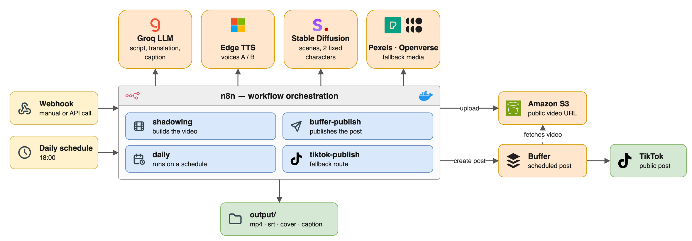
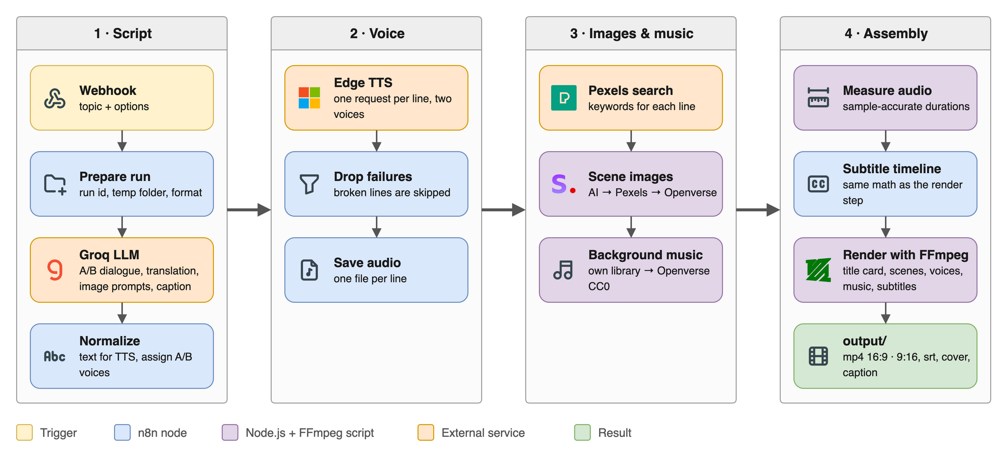
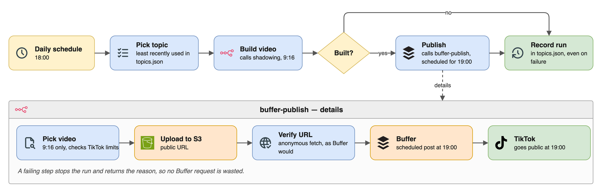
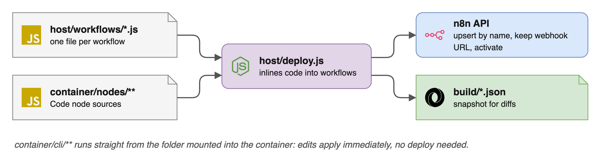

# AI Shadowing Video Generator

Automatically builds **English shadowing practice videos**: a two-person dialogue
with two voices, subtitles, and a pause after every line so the learner can repeat
it. The videos are then **published to TikTok through Buffer** every day. The
whole pipeline runs on self-hosted n8n in Docker, at **$0** cost.

> The code lives in [`data/workflow/`](data/workflow/).
> Coding rules: [`CLAUDE.md`](data/workflow/CLAUDE.md) ·
> Status, known limitations, roadmap: [`docs.md`](data/workflow/docs.md)
> (both in Vietnamese)

---

## 1. Architecture



- **n8n** orchestrates every workflow and renders the video with FFmpeg.
- **Content** comes from Groq (script, translation, caption), Edge TTS (voices) and
  Stable Diffusion (scene images with two fixed characters). Pexels and Openverse
  are the fallback sources for images and music.
- **Publishing** goes through Buffer. Buffer has no upload endpoint, so the video is
  first put on S3 at a public URL.

---

## 2. Repository layout

```
ad-test/
├── README.md
├── docs/diagrams/            ← diagram images (PNGs with the draw.io source embedded)
└── data/workflow/            ← the whole project
    ├── docker-compose.yml
    ├── infra/                  n8n Dockerfile (with FFmpeg)
    ├── host/                   runs outside the container
    │   ├── deploy.js             pushes workflows to n8n
    │   ├── workflows/            one file per workflow
    │   ├── imagegen/             image generation service (Python)
    │   └── ...                   debugging tools, subtitle checker, TikTok OAuth
    ├── container/              runs inside the n8n container
    │   ├── cli/                  media scripts (Node.js + FFmpeg)
    │   └── nodes/                Code node sources, grouped by workflow
    ├── build/                  workflow snapshots generated by deploy.js
    ├── assets/                 characters A/B, background music
    ├── topics.json             topic pool + run history
    └── publish.config.json     publishing settings (no keys)
```

Folders are split by **where the code runs**, not by file type: the path alone tells
you whether a file runs on the host or inside the container.

---

## 3. Workflows

| Workflow | Trigger | What it does |
|---|---|---|
| `shadowing` | webhook | Builds a video from a topic |
| `shadowing-stub` | webhook | Same, with a canned dialogue, for testing without spending LLM quota |
| `buffer-publish` | webhook | Publishes a video to TikTok through Buffer **(main route)** |
| `tiktok-publish` | webhook | Sends a video to the TikTok drafts inbox (fallback) |
| `daily` | schedule, 18:00 | Picks a topic → builds the video → schedules it on Buffer for 19:00 |

### 3.1 Building a video: `shadowing`



Output of every run:

| File | Contents |
|---|---|
| `<runId>.mp4`, `<runId>_portrait.mp4` | 16:9 and/or 9:16 video |
| `<runId>.srt` | subtitles |
| `<runId>.json` | run record: lines, speakers, durations, pauses, loudness |
| `<runId>_cover.jpg` | cover image, taken from the title card at the start of the video |
| `<runId>_caption.txt` | caption + hashtags |

**Subtitle sync is the most fragile part.** The *Subtitle timeline* step and the
*Render with FFmpeg* step must use the same formula: line `i` starts at the sum of
`(duration + pause)` of every line before it. Change one without the other and the
subtitles slowly drift. `host/verify-sync.js` checks this against the actual mp4.

Scene images are tried in order: **AI generated → Pexels → Openverse**. If the image
service is not running, the video still renders, just with stock photos.

### 3.2 Daily run and publishing: `daily` + `buffer-publish`



- `daily` duplicates no logic: it calls the same two webhooks, `shadowing` and
  `buffer-publish`.
- Topics are picked **least recently used first**, not at random. The `pool` in
  `topics.json` can be edited at any time; `history` is written by the workflow and
  should not be edited by hand.
- Built at 18:00, published at 19:00: the hour in between is a buffer for the
  external services.

### 3.3 Fallback route: `tiktok-publish`

Calls TikTok's Content Posting API directly. This route can only drop the video into
the drafts inbox, where it has to be posted by hand in the app. It is fully built
but waiting on configuration on the TikTok side; see section B of `docs.md`.

---

## 4. Deploying



| What changed | What to do |
|---|---|
| `host/workflows/*.js` | run `node host/deploy.js` again |
| `container/nodes/**` | run `node host/deploy.js` again, because n8n keeps its own copy of the code |
| `container/cli/**` | nothing, takes effect immediately |
| `infra/` | `docker compose up -d --build` |

To add a workflow: create `host/workflows/<slug>.js`, put its Code nodes in
`container/nodes/<slug>/`, register it in `REGISTRY` in `host/deploy.js`, then run
`node host/deploy.js <slug>`.

---

## 5. Quick start

```bash
cd data/workflow

docker compose up -d --build          # start n8n + Edge TTS
node host/deploy.js                   # push every workflow to n8n

# test the pipeline without spending LLM quota
curl -X POST http://localhost:5678/webhook/shadowing-stub \
  -H 'Content-Type: application/json' -d '{"topic":"smoke test"}'

# real run
curl -X POST http://localhost:5678/webhook/shadowing \
  -H 'Content-Type: application/json' \
  -d '{"topic":"asking for directions","sentenceCount":6,"orientation":"portrait"}'

node host/inspect-execution.js        # inspect the latest run, node by node
node host/verify-sync.js              # check that the subtitles are in sync
```

API keys (Groq, Pexels, AWS, Buffer) are set up as n8n **Credentials**. Detailed
setup steps are in [`CLAUDE.md`](data/workflow/CLAUDE.md).
